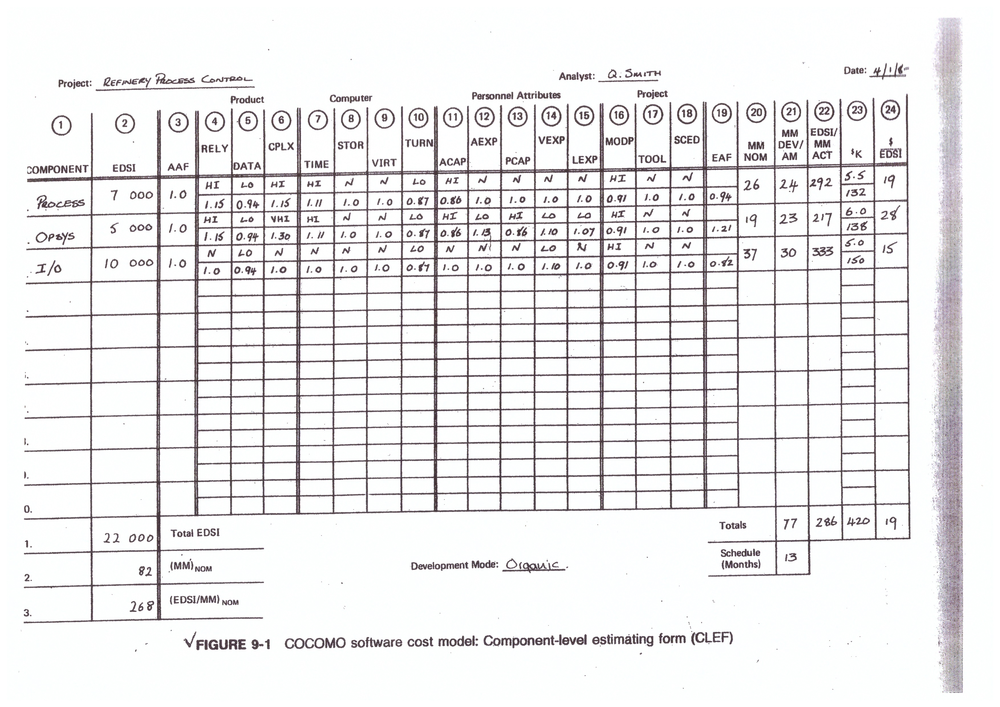

소프트웨어공학_COCOMO

## COCOMO (COnstructive COst MOdel) 방식

**수학적 산정 기법**
- 상향식 비용 산정 기법
- 경험적 추정 or 실험적 추정 기법

**`소프트웨어의 규모(LOC)`** 를 예측한 후 소프트웨어 종류에 따라 각 **`비용 산정 공식`** 에 대입하여 비용 산정

### 소프트웨어 유형
- BASIC
- INTERMEDIATE
- EMBEDDED

    #### 개발 모드
    - Organic
    - Semidetached
    - Embedded

---

**LOC (Lines of Code)** : `코드 라인 수 `

**MM (Man/Month)** : `소프트웨어 개발에 필요한 인력(Effort)의 단위`, `한 달에 필요한 사람의 수`
*PM(Person/Month)이라고도 한다.*

**DSI (Delivered Source Instruction)** : `전달된 소스 명령어`
*Delivered: 테스트 혹은 비공식 코드가 아닌, 최종*

**EDSI (Equivalent number of Delivered Source Instruction)** : `전달된 소스 명령어의 수 (비율)`

**EAF (Effort Adjustment Factor)** : `노력 조정 수치`, `필요한 각 항목에 승수 값을 모두 곱한 값`

**(MM) NOM** : `공식으로 구한 명목상의 MM`
- BASIC
  - Organic
    > `MM = 2.4(KDSI)^1.05`
  - Semidetached
    > `MM = 3.0(KDSI)^1.12`
  - Embedded
    > `MM = 3.6(KDSI)^1.20`
- INTERMEDIATE
  - Organic
    > `MM = 3.2(KDSI)^1.05`
  - Semidetached
    > `MM = 3.0(KDSI)^1.12`
  - Embedded
    > `MM = 2.8(KDSI)^1.20`

**(EDSI/MM) NOM** : `한 사람이 한 달에 짜야하는 코드의 수 (비율)`
> `Total EDSI / (MM) NOM`

**MM DEV/AM** : `분석 기법으로 인해 보정된 사람 수`
> `EAF * MM NOM`

**EDSI/MM ACT** : `실제로 한 사람이 한 달에 짜야하는 코드의 수 (비율)`

**$K** : `1인당 임금 (천 달러 단위)`
> `총 예산 = 1인당 임금 * MM DEV/AM`

**$/EDSI** : `코드 수 당 예산` 
> `(총 예산) / EDSI`

---
#### Totals

**MM DEV/AM**
> `각 항목을 모두 더한다`

**EDSI / MM  ACT**
> `(Total EDSI) / (Total MM DEV/AM)`

**$K**
> `각 항목을 모두 더한다`

**$/EDSI**
> `(total $) / (total EDSI)`

---

**Schedule (Months)** : `소프트웨어가 완성되는 기간`
- BASIC and INTERMEDIATE
  - Organic
    > `TDEV = 2.5(MM)^0.38`
  - Semidetached
    > `TDEV = 2.5(MM)^0.35`
  - Embedded
    > `TDEV = 2.5(MM)^0.32`